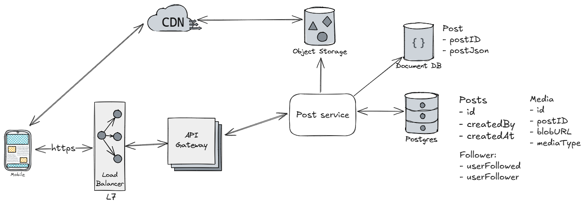
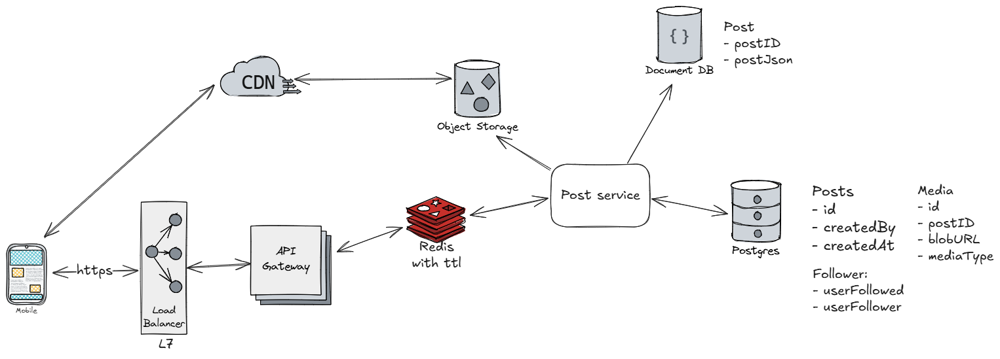
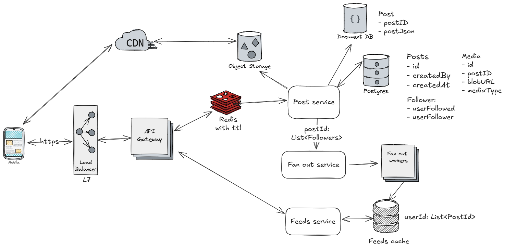
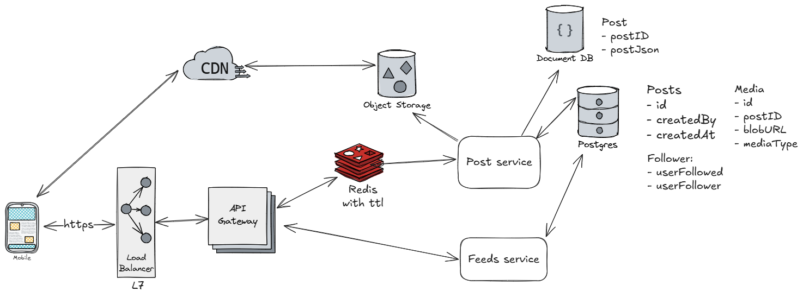

# Problem statement:

Design a news feed system similar to facebook and twitter.

## Functional requirements:
Users should be able to:
1. Create a post
2. Scroll through news feed
3. Follow users

Bonus:
1. User should be able to read and write comments on a post.
2. User should be able to search for a post

## Non functional requirements
1. Latency should be small ~500ms
2. Posts should be in reverse chronological order.
3. It should be able to handle celebrity posts.


## Entities
1. Posts
2. Users


## APIs
- Create Post:         POST /posts/
- Get particular post: GET /posts/{postID}
- Get news feed:       GET /feed/


## Simple solution with all functional requirements satisfied
### Create Post:         POST /posts/



1. User create a POST request with all post contents:
   ```json
   {
       text: "",
       media: "",
   }
   ```
2. Post service will add an entry in Posts table with a new post id, created by and created at field.
3. Using the same post id, text content can be stored in document db (e.g. mongo).
4. Media will be stored in object storage, meta data for it can be stored in postgres for easy retrieval.
5. Media upload can be optimized by using signed url for object storage.

### Get particular post: GET /posts/{postID}

1. Similar to POST, user will make a request to particular post id.
2. As post do not change much, it can be cached in Redis.
3. There may be `hot-key` issue in getting a post as some viral post may be retrived a lot.
   To solve that either of below techniques can be used:
   - Use client-side in-memory caching to reduce repeated Redis requests.
   - Distribute load by storing data under multiple keys and randomizing reads.
   - Add and scale Redis read replicas to handle increased read traffic.

### Get news feed:       GET /feed/
This can be implemented in two ways
1. Fan-out on write (push based): Pre-populates the feed for user
2. Fan-out on read (pull based):  Creates feed on the fly

#### _Fan-out on write:_
- In this case we prepare the feed cache for a user, this cache can be populated when any of the friends of
user have created a post.
- Here fetching of feed becomes fast but adds extra complication on writing a post.
- We may build feed cache for a user who is inactive from a long time.
- For a post created by celebrity, writing to feeds for all the followers might be resource consuming.


**Extra steps need to be done while creating post**:
1. User makes a POST request to post service.
2. POST services queries all the users which are being followed by post creator.
Here secondary index can be used to optimize query but graph db are overkill.
3. POST services sends a request to Fan-out service with post-ID and list of users.
4. Fan-out service keeps a pool of worker where each worker updates the feed cache for pair <user-ID, post-ID>.
5. As soon as Fan-out service receives the request, it distributes the tasks among the workers.
6. After workers are done, all users' feed should be updated by list of posts.

**Fetching the feed**:
1. As feed is already populated in feeds cache, fetching is just fetching all ids of posts.
2. Once the whole feed or a page of feed is fetched, client can make request for individual feeds and their media.
3. Feeds cache can be made persisted, sorted and evicted based on custom logic. A few of the options are redis and dynamo-db.

#### _Fan-out on read:_

- In this case, as soon as user makes a feed request we perform below steps:
    - Fetch all the users which current user follow.
    - Fetch their recent posts and return that.
- Here no overhead on write but as we are computing this on read, reads will be slow.

## Notes:
- User follow service have skipped but that is a simple crud (no graph).
