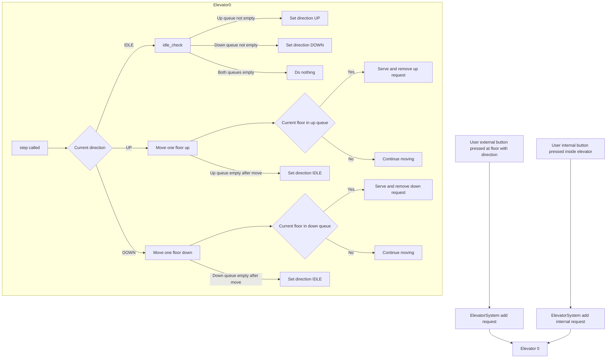

# Problem statement
1. There are multiple floors and multiple elevators.
2. User can make request standing on a floor or inside an elevator.
3. User who are inside elevator should be served by the same elevator.
4. Optimize for the distance travelled by elevator.

## Central decision problems:
1. Who does what? It is clear that there are two systems elevator and some dispatcher, but who does what
   is cumbersome. For simplicity, elevator just takes the request and keep serving those requests.
2. Dispatcher takes request from users and decide which elevator need to take that request and sends it.

