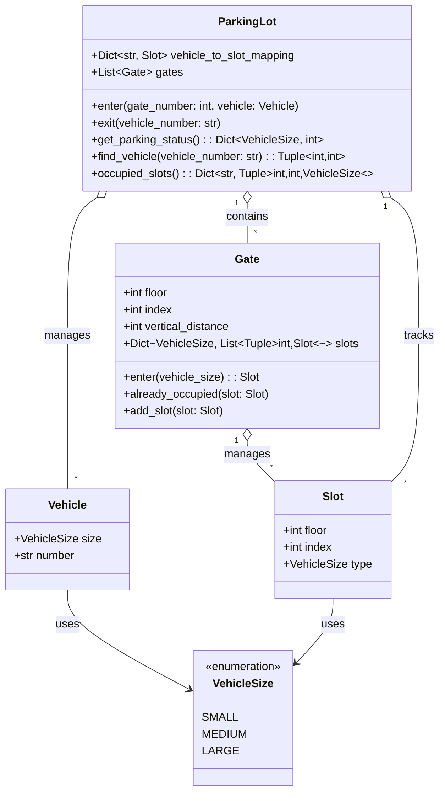

# Problem statement:

Design a parking lot with below requirements:
1. User should be able to park vehicles of various sizes.
2. User should be able to unpark their vehicles.
3. There can be multiple entrances to the parking lot.
4. User should always get the nearest available slot to the gate.
5. User should be able to check how many slots are available of each type.
6. User should be able get status of each slot, whether they are free and if occupied then vehicle number.
7. Vehicle number should also be searchable which returns the slot number.

# Solution:

## Assumptions:
1. Parking lot have multiple floors but parking slots are in a line.
2. All gates are on grond floor.
3. Max number of slots per floor are 1000.
4. A single threaded operation is assumed meaning one gate can be accessed at a time.
5. All floor are connected by only one path near to slot number 0.
6. For simplicity, each slot size repeats uniformly ie. small slot followed by medium followed by large.

## Center problem:
Problem is mostly around managing nearest slot which need to be managed per slot type and also
per gate.

Naive approach could be for every request, start iterating over all the slots and find the minimum.
This will have high time complexity but low space complexity.

### Better approach:
Maintain a heap for per gate per type and whenever an entry is made, make sure we remove it from other gates.

Removing again might be O(n) so that can be furthur optimized by maintaining a hash map for each heap.

UML:

