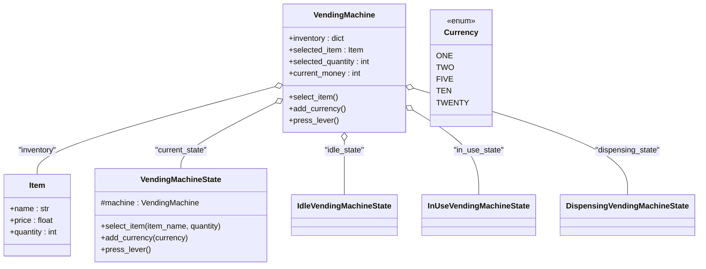

```mermaid
classDiagram

    class VendingMachine {
        +inventory : dict
        +selected_item : Item
        +selected_quantity : int
        +current_money : int
        +select_item()
        +add_currency()
        +press_lever()
    }

    class VendingMachineState {
        +select_item(item_name, quantity)
        +add_currency(currency)
        +press_lever()
        #machine : VendingMachine
    }

    class IdleVendingMachineState
    class InUseVendingMachineState
    class DispensingVendingMachineState

    class Item {
        +name : str
        +price : float
        +quantity : int
    }

    class Currency {
        <<enum>>
        ONE
        TWO
        FIVE
        TEN
        TWENTY
    }

    VendingMachine o-- Item : "inventory"
    VendingMachine o-- VendingMachineState : "current_state"
    VendingMachine o-- IdleVendingMachineState : "idle_state"
    VendingMachine o-- InUseVendingMachineState: "in_use_state"
    VendingMachine o-- DispensingVendingMachineState: "dispensing_state"
```
