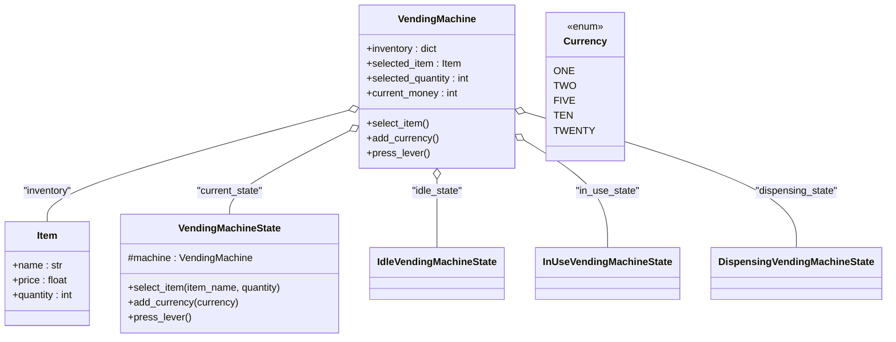

# Vending Machine - Requirements

## Functional Requirements

1. The vending machine maintains an inventory of items.
2. Each item has:
   - Name (string)
   - Price (float)
   - Quantity (integer, stock level)
3. Users must select an item and specify a quantity before adding money.
4. If the selected item does not exist or there is insufficient quantity, an error must be raised.
5. The vending machine accepts currency denominations represented as: One, Two, Five, Ten, and Twenty.
6. Users add currency values one at a time; the machine keeps track of the total amount inserted.
7. When the inserted money is equal to or exceeds the total price (item price × quantity), the machine automatically transitions to a dispensing state.
8. Users press the lever to dispense the item.
9. Pressing the lever when funds are insufficient raises an error.
10. Upon dispensing, the machine:
    - Reduces the item quantity accordingly.
    - Returns any change if the user inserted extra money.
    - Resets to the idle state for the next transaction.
11. The system follows the State Design Pattern with three main states:
    - Idle State: waiting for item selection. Adding currency or pressing the lever is not allowed.
    - In Use State: item selected, waiting for sufficient funds. Re-selection of item not allowed.
    - Dispensing State: sufficient funds, waiting for lever press. Adding currency or item selection not allowed.
12. Invalid operations on any state result in meaningful error messages or exceptions.

## Non-Functional Requirements

1. The design should be extensible to support adding new states or currency types easily.
2. The design should be maintainable, with clear separation between state behaviors and core vending machine logic.
3. Error messages should be descriptive to help users understand failure reasons.

## Things not implemented:
1. Change calculation: Here we do not check whether we have the required change.
2. Cancellation: User cannot cancel the transaction.

